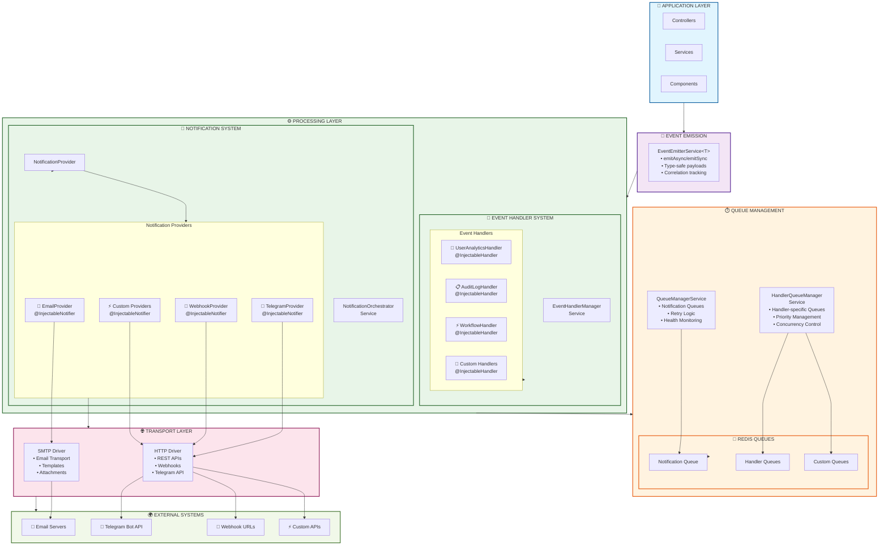

# NestJS Event Notifications

Une librairie moderne et extensible pour gérer les notifications d'événements dans les applications NestJS.

## 🚀 Caractéristiques

- **🏗️ Architecture ultra-simplifiée** - Providers autonomes sans complexité de drivers
- **🔒 Extensions d'interface TypeScript** - Type safety garantie avec support des propriétés dynamiques
- **📧 Providers simplifiés** - Email, Telegram, Webhook, Teams ultra-simples + template providers dédiés
- **🎯 RecipientLoader** - Résolution dynamique des destinataires
- **🔍 Auto-découverte** - Décorateurs `@InjectableNotifier` et `@InjectableHandler` pour découverte automatique
- **⚡ Gestion intelligente des queues** - Modes `api`, `worker`, `hybrid` avec FileQueueProvider (par défaut) ou Redis
- **⚙️ Configuration simplifiée** - Plus besoin de configuration manuelle des providers
- **🎯 Event Handler System** - Pattern handlers pour logique métier (analytics, audit, workflows)
- **🔄 Dual Processing** - Notifications externes + Handlers métier en parallèle
- **🧪 Tests complets** - Couverture > 80% avec 43 tests unitaires
- **🚀 Provider Teams** - Support Microsoft Teams avec Adaptive Cards
- **📁 FileQueueProvider** - Broker simple basé sur fichiers (pas de Redis requis)


## 📦 Installation

```bash
npm install @afidos/nestjs-event-notifications
```

## 🆕 Version 2.2.2 - Nouveautés

### 🔧 Améliorations de Configuration
- **Configuration standardisée** des exemples avec chemins unifiés
- **Gestion d'environnement améliorée** avec ConfigModule.forRoot()
- **Nettoyage des configurations** - Suppression des imports dupliqués
- **Optimisation nest-cli.json** avec tsConfigPath configuré
- **Exemples Bull/BullMQ** - Modules d'exemple séparés pour chaque provider

### 📁 Structure de Fichiers Optimisée
- **Suppression des fichiers de base de données** du contrôle de version
- **Chemins standardisés** : `./db.sqlite` au lieu de `./data/db.sqlite`
- **Modules d'intégration** dédiés pour Bull et BullMQ
- **Tests de queue** avec exemples concrets

## 🏗️ Architecture

La librairie suit une architecture modulaire basée sur les patterns **Event-Driven Architecture**, **Publisher-Subscriber** et **Handler Pattern**. Elle supporte deux approches complémentaires :

### Vue d'ensemble



### 1. Système de Notifications (Communication Externe)
- **EmailProvider** - Utilise SmtpDriver + `{ email?, firstName?, lastName? }`
- **TelegramProvider** - Utilise HttpDriver + `{ telegramId?, telegramUsername? }`
- **WebhookProvider** - Utilise HttpDriver + `{ webhookUrl?, webhookHeaders? }`
- **Auto-découverte** avec `@InjectableNotifier`

### 2. Système d'Event Handlers (Logique Métier)
- **UserAnalyticsHandler** - Traitement analytics des événements utilisateur
- **AuditLogHandler** - Audit et logging de tous les événements  
- **WorkflowHandler** - Orchestration de workflows métier
- **Auto-découverte** avec `@InjectableHandler`

### 3. Drivers (Transport)
- **HttpDriver** - Communications HTTP (APIs, webhooks, Telegram, etc.)
- **SmtpDriver** - Envoi d'emails avec nodemailer

### 4. Gestion des Queues
- **Mode `api`** : Traitement immédiat uniquement
- **Mode `worker`** : Queue Redis obligatoire, traitement différé
- **Mode `hybrid`** : Queue si disponible, sinon traitement immédiat

### 5. RecipientLoader
Interface pour résoudre dynamiquement les destinataires selon le type d'événement.

📖 **Documentation complète** : Consultez [ARCHITECTURE.md](./ARCHITECTURE.md) pour une vue détaillée de l'architecture.

## 🚀 Démarrage Rapide

### 1. Configuration des Types d'Événements

```typescript
// config.ts
import { EventPayloads, createEventTypeConfig } from '@afidos/nestjs-event-notifications';

export interface MyAppEvents extends EventPayloads {
    'user.created': {
        id: number;
        email: string;
        firstName: string;
        lastName: string;
    };
    'order.shipped': {
        id: string;
        userId: number;
        customerEmail: string;
        customerName: string;
        trackingNumber?: string;
    };
}

export const eventTypesConfig = createEventTypeConfig<MyAppEvents>({
    'user.created': {
        description: 'Nouvel utilisateur créé',
        channels: ['email', 'telegram'],  // ← Identifiants des providers
        defaultProcessing: 'async',
        retryAttempts: 3
    },
    'order.shipped': {
        description: 'Commande expédiée',
        channels: ['email', 'telegram'],
        defaultProcessing: 'async',
        retryAttempts: 2
    }
});

// Configuration du package (simplifiée)
export const packageConfig = createPackageConfig<MyAppEvents>({
    eventTypes: eventTypesConfig,
    
    // Plus besoin de configuration providers !
    // L'auto-découverte via @InjectableNotifier s'en charge
    
    queue: {
        redis: {
            host: process.env.REDIS_HOST || 'localhost',
            port: parseInt(process.env.REDIS_PORT || '6379')
        }
    },
    
    mode: 'hybrid',  // ou 'api', 'worker'
    
    global: {
        defaultTimeout: 30000,
        enableDetailedLogs: true
    }
});
```

### 2. Configuration du Module

```typescript
// app.module.ts
import { Module } from '@nestjs/common';
import {
    EventNotificationsModule,
    HttpDriver,
    SmtpDriver
} from '@afidos/nestjs-event-notifications';
import { EmailProvider } from './providers/email.provider';
import { TelegramProvider } from './providers/telegram.provider';
import { StaticRecipientLoader } from './loaders/static-recipient.loader';
import { eventTypesConfig } from './config';

@Module({
    imports: [
        EventNotificationsModule.forRoot<MyAppEvents>({
            config: packageConfig,
            recipientLoader: StaticRecipientLoader  // ← Nouvelle API
        })
    ],
    providers: [
        // Drivers
        HttpDriver,
        {
            provide: SmtpDriver,
            useFactory: () => new SmtpDriver({
                host: process.env.SMTP_HOST || 'smtp.gmail.com',
                port: parseInt(process.env.SMTP_PORT || '587'),
                auth: {
                    user: process.env.SMTP_USER,
                    pass: process.env.SMTP_PASS
                }
            })
        },
        
        // Providers avec auto-découverte
        EmailProvider,     // ← Plus besoin de factory!
        TelegramProvider,  // ← Auto-découverte via @InjectableNotifier
        WebhookProvider    // ← Configuration dans le décorateur
    ]
})
export class AppModule {}
```

### 3. Variables d'Environnement

```bash
# Email (SMTP)
SMTP_HOST=smtp.gmail.com
SMTP_USER=your-email@gmail.com  
SMTP_PASS=your-app-password
SMTP_FROM=noreply@yourapp.com

# Telegram
TELEGRAM_BOT_TOKEN=123456789:ABCdefGHIjklMNOpqrsTUVwxyz

# Redis (optionnel)
REDIS_HOST=localhost
REDIS_PORT=6379
```

### 4. Créer un Event Handler

Les **Event Handlers** permettent d'exécuter de la logique métier en réaction aux événements (analytics, audit, workflows, etc.). Ils s'exécutent **en parallèle** des notifications.

```typescript
// handlers/user-analytics.handler.ts
import { Injectable, Logger } from '@nestjs/common';
import {
    EventHandler,
    InjectableHandler,
    EventHandlerContext
} from '@afidos/nestjs-event-notifications';

@InjectableHandler({
    name: 'UserAnalyticsHandler',
    eventTypes: ['user.created', 'user.updated', 'user.deleted'],
    priority: 100, // Plus élevé = traité en premier
    queue: {
        processing: 'async', // 'sync', 'async', 'delayed'
        priority: 8,
        retry: { 
            attempts: 3, 
            backoff: { type: 'exponential', delay: 2000 } 
        },
        timeout: 30000,
        concurrency: 5
    }
})
@Injectable()
export class UserAnalyticsHandler implements EventHandler {
    private readonly logger = new Logger(UserAnalyticsHandler.name);

    getName(): string {
        return 'UserAnalyticsHandler';
    }

    getEventTypes(): string[] {
        return ['user.created', 'user.updated', 'user.deleted'];
    }

    getPriority(): number {
        return 100;
    }

    canHandle(eventType: string): boolean {
        return this.getEventTypes().includes(eventType);
    }

    async execute(
        eventType: string, 
        payload: any, 
        context: EventHandlerContext
    ): Promise<any> {
        this.logger.log(`Traitement analytics pour ${eventType}`);

        switch (eventType) {
            case 'user.created':
                await this.trackUserRegistration(payload);
                break;
            case 'user.updated':
                await this.trackUserUpdate(payload);
                break;
            case 'user.deleted':
                await this.trackUserDeletion(payload);
                break;
        }

        return { 
            processed: true, 
            timestamp: new Date(),
            analytics: 'updated'
        };
    }

    // Lifecycle callbacks (optionnels)
    async beforeQueue(eventType: string, payload: any, context: EventHandlerContext): Promise<void> {
        this.logger.debug(`Préparation queue pour ${eventType}`);
    }

    async afterExecute(eventType: string, payload: any, result: any, context: EventHandlerContext): Promise<void> {
        this.logger.log(`Analytics terminé pour ${eventType}: ${JSON.stringify(result)}`);
    }

    async onError(error: Error, eventType: string, payload: any, context: EventHandlerContext): Promise<void> {
        this.logger.error(`Erreur analytics ${eventType}: ${error.message}`);
        // Optionnel: alerting, fallback logic, etc.
    }

    async isHealthy(): Promise<boolean> {
        // Vérification de la santé (connexion DB, API externes, etc.)
        return true;
    }

    private async trackUserRegistration(payload: any) {
        // Logique analytics pour inscription
        // Ex: envoyer à Google Analytics, Mixpanel, etc.
    }

    private async trackUserUpdate(payload: any) {
        // Logique analytics pour modification
    }

    private async trackUserDeletion(payload: any) {
        // Logique analytics pour suppression
    }
}
```

### Handler pour Audit (Wildcard)

```typescript
// handlers/audit-log.handler.ts
@InjectableHandler({
    name: 'AuditLogHandler',
    eventTypes: ['*'], // Traite TOUS les événements
    priority: 50,
    queue: {
        processing: 'sync' // Exécution immédiate pour audit
    }
})
@Injectable()
export class AuditLogHandler implements EventHandler {
    private readonly logger = new Logger(AuditLogHandler.name);

    async execute(eventType: string, payload: any, context: EventHandlerContext): Promise<any> {
        // Audit sécurisé (sans données sensibles)
        const auditPayload = this.sanitizePayload(payload);
        
        // Enregistrement en base de données
        await this.auditRepository.save({
            eventType,
            payload: auditPayload,
            correlationId: context.correlationId,
            timestamp: context.timestamp,
            userId: auditPayload.userId || null
        });

        return { audited: true };
    }

    private sanitizePayload(payload: any): any {
        // Supprime les données sensibles (mots de passe, tokens, etc.)
        const { password, token, ...safePayload } = payload;
        return safePayload;
    }
}
```

### Enregistrement des Handlers

```typescript
// app.module.ts
@Module({
    imports: [
        EventNotificationsModule.forRoot<MyAppEvents>(packageConfig)
    ],
    providers: [
        // Drivers
        HttpDriver,
        SmtpDriver,
        
        // Notification Providers (auto-découverte)
        EmailProvider,
        TelegramProvider,
        
        // Event Handlers (auto-découverte)
        UserAnalyticsHandler,
        AuditLogHandler,
        
        // Recipient Loader
        StaticRecipientLoader
    ]
})
export class AppModule {}
```

### 5. Créer un Provider (Optionnel)

```typescript
// providers/email.provider.ts
import { Logger } from '@nestjs/common';
import {
    BaseNotificationProvider,  // ← Classe de base avec méthodes communes
    SmtpDriver,
    RecipientLoader,
    Recipient,
    NotificationResult,
    NotificationContext,
    EmailMessage,
    InjectableNotifier  // ← Nouveau décorateur
} from '@afidos/nestjs-event-notifications';

// Extension de l'interface Recipient
declare module '@afidos/nestjs-event-notifications' {
    interface Recipient {
        email?: string;
        firstName?: string;
        lastName?: string;
    }
}

@InjectableNotifier({
    channel: 'email',        // ← Identifiant pour discovery
    driver: 'smtp',          // ← Driver utilisé
    description: 'Provider pour notifications email via SMTP'
})  // ← @InjectableNotifier applique automatiquement @Injectable()
export class EmailProvider extends BaseNotificationProvider {  // ← Hérite de BaseNotificationProvider

    constructor(
        recipientLoader: RecipientLoader,
        private readonly smtpDriver: SmtpDriver,
        private readonly fromEmail: string = 'noreply@example.com'
    ) {
        super(recipientLoader);  // ← Appel du constructeur parent
    }

    async send(payload: any, context: NotificationContext): Promise<NotificationResult> {
        try {
            // 1. Charger tous les destinataires pour cet événement
            const allRecipients = await this.recipientLoader.load(context.eventType, payload);

            // 2. Filtrer par la propriété email (méthode héritée)
            const emailRecipients = this.filterRecipientsByProperty(allRecipients, 'email');

            if (emailRecipients.length === 0) {
                return this.createSkippedResult(context, 'No email recipients found');  // ← Méthode héritée
            }

            // 3. Prendre le premier recipient et envoyer
            const recipient = emailRecipients[0];
            const address = recipient.email as string;
            
            return await this.sendToAddress(address, context.eventType, payload, recipient, context);

        } catch (error) {
            return this.createFailedResult(context, `Failed to send: ${error.message}`);  // ← Méthode héritée
        }
    }

    private async sendToAddress(
        address: string,
        eventType: string,
        payload: any,
        recipient: Recipient,
        context: NotificationContext
    ): Promise<NotificationResult> {
        try {
            const message: EmailMessage = {
                to: address,
                from: this.fromEmail,
                subject: this.buildSubject(eventType, payload),
                html: this.buildHtmlBody(eventType, payload, recipient),
                text: this.buildTextBody(eventType, payload, recipient)
            };

            const result = await this.smtpDriver.send(message);

            // Utilise la méthode héritée pour créer le résultat
            return this.createSentResult(context, {
                messageId: result.messageId,
                recipientId: recipient.id,
                accepted: result.accepted,
                rejected: result.rejected
            });

        } catch (error) {
            // Utilise la méthode héritée pour créer le résultat d'erreur
            return this.createFailedResult(context, error.message, {
                recipientId: recipient.id,
                address
            });
        }
    }

    private buildSubject(eventType: string, payload: any): string {
        switch (eventType) {
            case 'user.created': return '🎉 Bienvenue !';
            case 'order.shipped': return '🚚 Commande expédiée';
            default: return `Notification: ${eventType}`;
        }
    }

    async healthCheck(): Promise<boolean> {
        return await this.smtpDriver.healthCheck();
    }

    validateConfig(_config: any): boolean | string[] {
        return true;
    }

    // Les méthodes getChannelName() et getProviderName() sont automatiquement héritées !
}
```

### 4. Créer un RecipientLoader

```typescript
// loaders/static-recipient.loader.ts
import { Injectable } from '@nestjs/common';
import { RecipientLoader, Recipient } from '@afidos/nestjs-event-notifications';

@Injectable()
export class StaticRecipientLoader implements RecipientLoader {
    async load(eventType: string, payload: any): Promise<Recipient[]> {
        switch (eventType) {
            case 'user.created':
                return [{
                    id: payload.id?.toString(),
                    email: payload.email,
                    firstName: payload.firstName,
                    lastName: payload.lastName,
                    preferences: { enabled: true }
                }];
                
            case 'order.shipped':
                return [{
                    id: payload.userId?.toString(),
                    email: payload.customerEmail,
                    firstName: payload.customerName?.split(' ')[0],
                    preferences: { enabled: true }
                }];
                
            default:
                return [];
        }
    }
}
```

### 6. Émettre des Événements

```typescript
// user.service.ts
import { Injectable } from '@nestjs/common';
import { EventEmitterService } from '@afidos/nestjs-event-notifications';
import { MyAppEvents } from './config';

@Injectable()
export class UserService {
    constructor(
        private readonly eventEmitter: EventEmitterService<MyAppEvents>
    ) {}

    async createUser(userData: any) {
        const user = await this.userRepository.save(userData);

        // Émettre l'événement (traitement dual automatique)
        const result = await this.eventEmitter.emitAsync('user.created', {
            id: user.id,
            email: user.email,
            firstName: user.firstName,
            lastName: user.lastName
        });
        
        /* 
        Le système traite automatiquement EN PARALLÈLE :
        
        📧 NOTIFICATIONS (Communication externe) :
        ├─ EmailProvider → Email de bienvenue
        └─ TelegramProvider → Notification Telegram

        🎯 HANDLERS (Logique métier) :
        ├─ UserAnalyticsHandler → Tracking analytics
        ├─ AuditLogHandler → Logging sécurisé
        └─ WorkflowHandler → Workflow d'onboarding
        */

        console.log('Résultat dual processing:', result);
        /*
        {
          eventId: "evt_1234567890",
          correlationId: "corr_abcdefgh",
          mode: "async",
          waitedForResult: false,
          queuedAt: "2025-01-19T10:30:00.000Z",
          results: [
            // Notifications
            { provider: "EmailProvider", status: "queued", jobId: "job_001" },
            { provider: "TelegramProvider", status: "queued", jobId: "job_002" },
            // Handlers
            { handler: "UserAnalyticsHandler", status: "queued", jobId: "handler_001" },
            { handler: "AuditLogHandler", status: "completed", result: { audited: true } },
            { handler: "WorkflowHandler", status: "queued", jobId: "handler_002" }
          ]
        }
        */

        return user;
    }
}
```

## 🔧 Configuration

### Variables d'Environnement

```bash
# Email (SMTP)
SMTP_HOST=smtp.gmail.com
SMTP_PORT=587
SMTP_USER=your-email@gmail.com
SMTP_PASS=your-password
SMTP_FROM=noreply@yourapp.com

# Telegram
TELEGRAM_BOT_TOKEN=123456789:ABCdefGHIjklMNOpqrsTUVwxyz

# Redis (pour les queues)
REDIS_HOST=localhost
REDIS_PORT=6379
REDIS_PASSWORD=optional

# Webhooks
WEBHOOK_URL=https://your-webhook-url.com

# FileQueueProvider (optionnel)
QUEUE_DATA_DIR=./custom-queue-data
```

## 📁 Queue Providers - Approche Modulaire

### 🚀 Nouveauté v2.2.0 - Architecture Sans Conflit de Dépendances

Le système de queue a été conçu pour éviter les **conflits de dépendances** entre providers. Seul le **FileQueueProvider** est exporté par défaut car il ne nécessite aucune dépendance externe.

### 🎯 FileQueueProvider (Par Défaut)

Le **FileQueueProvider** est un broker de queue simple qui utilise le **système de fichiers** pour la persistance des jobs. Il est parfait pour le développement, les tests et les applications avec des charges légères.

### ✨ Avantages

- **🚀 Démarrage immédiat** - Aucune infrastructure externe requise
- **📁 Debug facile** - Jobs visibles dans des fichiers JSON 
- **🔧 Configuration zéro** - Fonctionne out-of-the-box
- **📊 Monitoring simple** - Inspection visuelle des queues
- **🐳 Déploiement léger** - Pas de Redis à gérer

### 🔧 Configuration et Usage

#### Configuration par Défaut

Par défaut, le **FileQueueProvider** est automatiquement utilisé quand aucun provider custom n'est spécifié :

```typescript
// Utilise automatiquement FileQueueProvider
EventNotificationsModule.forRoot<MyAppEvents>({
    config: packageConfig,
    recipientLoader: StaticRecipientLoader
    // queueProvider omis = FileQueueProvider par défaut
})
```

#### Configuration Personnalisée

```typescript
import { FileQueueProvider } from '@afidos/nestjs-event-notifications';

EventNotificationsModule.forRoot<MyAppEvents>({
    config: packageConfig,
    recipientLoader: StaticRecipientLoader,
    queueProvider: FileQueueProvider  // Explicite
})
```

#### Variables d'Environnement

```bash
# Répertoire de stockage des fichiers de queue
QUEUE_DATA_DIR=./queue-data

# Configuration du nom de queue (optionnel)
QUEUE_PREFIX=my-app-notifications
```

### 📊 Structure des Fichiers de Queue

Les jobs sont stockés dans des fichiers JSON :

```json
// ./queue-data/notifications-queue.json
[
  {
    "id": "file-job-1751458285777-rpd6xekry",
    "name": "process-notification", 
    "data": {
      "eventId": "evt_1751458285777_gzy9p5y10",
      "eventType": "user.created",
      "payload": {
        "id": 123,
        "email": "user@example.com",
        "firstName": "John",
        "lastName": "Doe"
      },
      "correlationId": "cor_1751458285777_ifx3p0v2q"
    },
    "status": "completed",           // waiting, active, completed, failed
    "attempts": 1,
    "maxAttempts": 3,
    "createdAt": "2025-07-02T12:11:25.777Z",
    "processingStartedAt": "2025-07-02T12:11:26.686Z",
    "completedAt": "2025-07-02T12:11:29.119Z",
    "result": [
      {
        "channel": "email",
        "provider": "EmailProvider",
        "status": "sent",
        "sentAt": "2025-07-02T12:11:28.435Z",
        "metadata": {
          "messageId": "<4f19e25e-f010-4148-6aab-aeed37279fad@example.com>",
          "recipientCount": 1,
          "accepted": ["customer@example.com"]
        }
      }
    ]
  }
]
```

### ⚙️ Fonctionnalités

- **✅ Processing asynchrone** - Jobs traités en arrière-plan
- **🔄 Retry automatique** - Gestion des tentatives avec backoff
- **📊 Health checks** - Monitoring de l'état de la queue
- **📈 Statistiques** - Compteurs waiting/active/completed/failed
- **🧹 Cleanup** - Nettoyage automatique des anciens jobs
- **⚡ Concurrence** - Support du processing parallèle

### 🎯 Cas d'Usage Idéaux

#### ✅ Recommandé pour :
- **🏠 Développement local** - Pas d'infrastructure à installer
- **🧪 Tests automatisés** - Environnements temporaires
- **📱 Applications légères** - < 1000 jobs/heure
- **🎯 Prototypage** - Démarrage rapide
- **🐳 Containers simples** - Docker sans Redis

#### ⚠️ À éviter pour :
- **🚀 Production haute charge** - > 10000 jobs/heure
- **🌐 Applications distribuées** - Plusieurs instances
- **⚡ Latence critique** - < 100ms processing
- **🔐 Données sensibles** - Sans chiffrement fichier

## 🔄 Providers Bull et BullMQ (Non Exportés)

### ⚠️ Pourquoi ne sont-ils pas exportés par défaut ?

Les providers **Bull** et **BullMQ** ne sont **pas exportés** dans le fichier `index.ts` pour éviter les **conflits de dépendances** :

- **Bull** et **BullMQ** sont **incompatibles** entre eux dans le même projet
- Installer les deux créerait des conflits de versions Redis
- Chaque projet ne devrait utiliser qu'**un seul** provider Redis

### 🎯 Bull Provider (Option 1)

Pour utiliser **Bull** dans votre projet :

```bash
# 1. Installer les dépendances Bull
npm install bull @nestjs/bull redis
```

```typescript
// 2. Import direct depuis le fichier source
import { BullQueueProvider } from '@afidos/nestjs-event-notifications/dist/queue/bull-queue.provider';
import { BullModule } from '@nestjs/bull';

@Module({
  imports: [
    BullModule.forRoot({
      redis: {
        host: 'localhost',
        port: 6379,
      },
    }),
    EventNotificationsModule.forRoot<MyAppEvents>({
      config: packageConfig,
      recipientLoader: StaticRecipientLoader,
      queueProvider: BullQueueProvider  // ← Import direct
    })
  ]
})
export class AppModule {}
```

### 🚀 BullMQ Provider (Option 2)

Pour utiliser **BullMQ** dans votre projet :

```bash
# 1. Installer les dépendances BullMQ
npm install bullmq @nestjs/bullmq redis
```

```typescript
// 2. Import direct depuis le fichier source
import { BullMQQueueProvider } from '@afidos/nestjs-event-notifications/dist/queue/bullmq-queue.provider';
import { BullMQModule } from '@nestjs/bullmq';

@Module({
  imports: [
    BullMQModule.forRoot({
      connection: {
        host: 'localhost',
        port: 6379,
      },
    }),
    EventNotificationsModule.forRoot<MyAppEvents>({
      config: packageConfig,
      recipientLoader: StaticRecipientLoader,
      queueProvider: BullMQQueueProvider  // ← Import direct
    })
  ]
})
export class AppModule {}
```

### 📋 Comparaison des Providers

| Provider | Dépendances | Performance | Production | Maintenance |
|----------|-------------|-------------|------------|-------------|
| **FileQueueProvider** | ❌ Aucune | 🟡 Légère | ⚠️ < 1K jobs/h | ✅ Active |
| **BullQueueProvider** | `bull` + `@nestjs/bull` | 🟢 Haute | ✅ Éprouvé | ⚠️ Legacy |
| **BullMQQueueProvider** | `bullmq` + `@nestjs/bullmq` | 🟢 Très Haute | ✅ Moderne | ✅ Active |

### 🎯 Recommandations d'Usage

#### FileQueueProvider - Développement/Tests
```typescript
// ✅ Développement local, tests, prototypage
EventNotificationsModule.forRoot({
  config: packageConfig,
  recipientLoader: StaticRecipientLoader
  // FileQueueProvider par défaut - aucune dépendance
})
```

#### Bull - Production Legacy
```typescript
// ✅ Applications existantes avec Bull
import { BullQueueProvider } from '@afidos/nestjs-event-notifications/dist/queue/bull-queue.provider';

EventNotificationsModule.forRoot({
  config: packageConfig,
  recipientLoader: StaticRecipientLoader,
  queueProvider: BullQueueProvider
})
```

#### BullMQ - Production Moderne
```typescript
// ✅ Nouvelles applications production
import { BullMQQueueProvider } from '@afidos/nestjs-event-notifications/dist/queue/bullmq-queue.provider';

EventNotificationsModule.forRoot({
  config: packageConfig,
  recipientLoader: StaticRecipientLoader,
  queueProvider: BullMQQueueProvider
})
```

## 🆕 Nouvelle API Module (v2.2.0)

### Migration de l'API

**Avant (v2.1.x) :**
```typescript
EventNotificationsModule.forRoot<MyAppEvents>(packageConfig)
```

**Après (v2.2.0) :**
```typescript
EventNotificationsModule.forRoot<MyAppEvents>({
    config: packageConfig,
    recipientLoader: StaticRecipientLoader,
    queueProvider?: FileQueueProvider  // Optionnel
})
```

### ✨ Avantages de la Nouvelle API

- **🔧 Configuration typée** - Meilleure type safety
- **📦 Injection automatique** - Plus de tokens manuels
- **🎯 Flexibilité** - QueueProvider et RecipientLoader configurables
- **🧹 Code plus propre** - Moins de boilerplate

### 🔒 Interface Recipient Extensible

Déclarez vos propriétés personnalisées :

```typescript
// Dans votre provider ou loader
declare module '@afidos/nestjs-event-notifications' {
    interface Recipient {
        email?: string;
        firstName?: string;
        lastName?: string;
        telegramId?: string;
        webhookUrl?: string;
        customProperty?: string;  // ← Vos propriétés
    }
}
```

## 📚 Exemple Complet

Consultez le dossier `examples/basic-usage` pour un exemple complet avec :
- **Auto-découverte des providers** via `@InjectableNotifier`
- Configuration TypeScript type-safe
- Gestion intelligente des queues (`hybrid` mode)
- Providers Email, Telegram et Webhook
- RecipientLoader statique
- Contrôleurs REST pour déclencher des événements
- Tests unitaires

## 🏃‍♂️ Lancer l'Exemple

```bash
cd examples/basic-usage
npm install
npm run build
npm run start:dev
```

Puis testez les endpoints :
```bash
# Créer un utilisateur (déclenche user.created)
curl -X POST http://localhost:3000/users \
  -H "Content-Type: application/json" \
  -d '{"email":"test@example.com","firstName":"John","lastName":"Doe","password":"test123"}'

# Créer une commande (déclenche order.created)
curl -X POST http://localhost:3000/orders \
  -H "Content-Type: application/json" \
  -d '{"customerId":1,"items":[{"productId":"prod1","quantity":2,"price":10.50}]}'
```


## 🤝 Contribution

Les contributions sont les bienvenues ! Pour contribuer :

1. Fork le projet
2. Créer une branche feature (`git checkout -b feature/amazing-feature`)
3. Commit les changes (`git commit -m 'Add amazing feature'`)
4. Push sur la branche (`git push origin feature/amazing-feature`)
5. Ouvrir une Pull Request

## 📄 Licence

[MIT](LICENSE)
