# NestJS Event Notifications

Une librairie moderne et extensible pour gérer les notifications d'événements dans les applications NestJS.

## 🚀 Caractéristiques

- **🏗️ Architecture basée sur des drivers** - Drivers HTTP et SMTP pré-configurés
- **🔒 Extensions d'interface TypeScript** - Type safety garantie avec support des propriétés dynamiques
- **📧 Providers extensibles** - Email, Telegram, Webhook pré-conçus + créez les vôtres
- **🎯 RecipientLoader** - Résolution dynamique des destinataires
- **🔍 Auto-découverte** - Décorateurs `@InjectableNotifier` et `@InjectableHandler` pour découverte automatique
- **⚡ Gestion intelligente des queues** - Modes `api`, `worker`, `hybrid` avec Redis
- **⚙️ Configuration simplifiée** - Plus besoin de configuration manuelle des providers
- **🎯 Event Handler System** - Pattern handlers pour logique métier (analytics, audit, workflows)
- **🔄 Dual Processing** - Notifications externes + Handlers métier en parallèle

## 📦 Installation

```bash
npm install @afidos/nestjs-event-notifications
```

## 🏗️ Architecture

La librairie suit une architecture modulaire basée sur les patterns **Event-Driven Architecture**, **Publisher-Subscriber** et **Handler Pattern**. Elle supporte deux approches complémentaires :

### Vue d'ensemble

```mermaid
graph TB
    %% Application Layer
    subgraph APP["üöÄ APPLICATION LAYER"]
        CTRL[Controllers]
        SERV[Services]
        COMP[Components]
    end

    %% Event Emitter
    subgraph EMIT["üì° EVENT EMISSION"]
        EES[EventEmitterService&lt;T&gt;<br/>• emitAsync/emitSync<br/>• Type-safe payloads<br/>• Correlation tracking]
    end

    %% Processing Layer
    subgraph PROC["⚙️ PROCESSING LAYER"]
        subgraph NOTIF["üìß NOTIFICATION SYSTEM"]
            NOS[NotificationOrchestrator<br/>Service]
            NPB[NotificationProvider]
            
            subgraph PROVIDERS["Notification Providers"]
                EP[üìß EmailProvider<br/>@InjectableNotifier]
                TP[üì± TelegramProvider<br/>@InjectableNotifier]
                WP[üîó WebhookProvider<br/>@InjectableNotifier]
                CP[‚ö° Custom Providers<br/>@InjectableNotifier]
            end
        end

        subgraph HANDLE["🎯 EVENT HANDLER SYSTEM"]
            EHM[EventHandlerManager<br/>Service]
            
            subgraph HANDLERS["Event Handlers"]
                UH[👤 UserAnalyticsHandler<br/>@InjectableHandler]
                AH[üìã AuditLogHandler<br/>@InjectableHandler]
                WH[‚ö° WorkflowHandler<br/>@InjectableHandler]
                CH[üîß Custom Handlers<br/>@InjectableHandler]
            end
        end
    end

    %% Queue Layer
    subgraph QUEUE["⏱️ QUEUE MANAGEMENT"]
        QMS[QueueManagerService<br/>• Notification Queues<br/>• Retry Logic<br/>• Health Monitoring]
        HQMS[HandlerQueueManager<br/>Service<br/>• Handler-specific Queues<br/>• Priority Management<br/>• Concurrency Control]
        
        subgraph REDIS["🔴 REDIS QUEUES"]
            NQ[Notification Queue]
            HQ[Handler Queues]
            CQ[Custom Queues]
        end
    end

    %% Transport Layer
    subgraph TRANSPORT["üåê TRANSPORT LAYER"]
        HD[HTTP Driver<br/>• REST APIs<br/>• Webhooks<br/>• Telegram API]
        SD[SMTP Driver<br/>• Email Transport<br/>• Templates<br/>• Attachments]
    end

    %% External Systems
    subgraph EXT["üåç EXTERNAL SYSTEMS"]
        EMAIL[üìß Email Servers]
        TELEGRAM[üì± Telegram Bot API]
        WEBHOOKS[üîó Webhook URLs]
        APIS[‚ö° Custom APIs]
    end

    %% Connections
    APP --> EMIT
    EMIT --> PROC
    
    PROC --> QUEUE
    
    NOTIF --> NPB
    NPB --> PROVIDERS
    
    HANDLE --> HANDLERS
    
    QUEUE --> REDIS
    QMS --> NQ
    HQMS --> HQ
    HQMS --> CQ
    
    PROVIDERS --> TRANSPORT
    EP --> SD
    TP --> HD
    WP --> HD
    CP --> HD
    
    TRANSPORT --> EXT
    SD --> EMAIL
    HD --> TELEGRAM
    HD --> WEBHOOKS
    HD --> APIS

    %% Styling
    classDef appLayer fill:#e1f5fe,stroke:#01579b,stroke-width:2px
    classDef emitLayer fill:#f3e5f5,stroke:#4a148c,stroke-width:2px
    classDef procLayer fill:#e8f5e8,stroke:#1b5e20,stroke-width:2px
    classDef queueLayer fill:#fff3e0,stroke:#e65100,stroke-width:2px
    classDef transportLayer fill:#fce4ec,stroke:#880e4f,stroke-width:2px
    classDef extLayer fill:#f1f8e9,stroke:#33691e,stroke-width:2px
    
    class APP appLayer
    class EMIT emitLayer
    class PROC,NOTIF,HANDLE procLayer
    class QUEUE,REDIS queueLayer
    class TRANSPORT transportLayer
    class EXT extLayer
```



### 1. Système de Notifications (Communication Externe)
- **EmailProvider** - Utilise SmtpDriver + `{ email?, firstName?, lastName? }`
- **TelegramProvider** - Utilise HttpDriver + `{ telegramId?, telegramUsername? }`
- **WebhookProvider** - Utilise HttpDriver + `{ webhookUrl?, webhookHeaders? }`
- **Auto-découverte** avec `@InjectableNotifier`

### 2. Système d'Event Handlers (Logique Métier)
- **UserAnalyticsHandler** - Traitement analytics des événements utilisateur
- **AuditLogHandler** - Audit et logging de tous les événements  
- **WorkflowHandler** - Orchestration de workflows métier
- **Auto-découverte** avec `@InjectableHandler`

### 3. Drivers (Transport)
- **HttpDriver** - Communications HTTP (APIs, webhooks, Telegram, etc.)
- **SmtpDriver** - Envoi d'emails avec nodemailer

### 4. Gestion des Queues
- **Mode `api`** : Traitement immédiat uniquement
- **Mode `worker`** : Queue Redis obligatoire, traitement différé
- **Mode `hybrid`** : Queue si disponible, sinon traitement immédiat

### 5. RecipientLoader
Interface pour résoudre dynamiquement les destinataires selon le type d'événement.

📖 **Documentation complète** : Consultez [ARCHITECTURE.md](./ARCHITECTURE.md) pour une vue détaillée de l'architecture.

## 🚀 Démarrage Rapide

### 1. Configuration des Types d'Événements

```typescript
// config.ts
import { EventPayloads, createEventTypeConfig } from '@afidos/nestjs-event-notifications';

export interface MyAppEvents extends EventPayloads {
    'user.created': {
        id: number;
        email: string;
        firstName: string;
        lastName: string;
    };
    'order.shipped': {
        id: string;
        userId: number;
        customerEmail: string;
        customerName: string;
        trackingNumber?: string;
    };
}

export const eventTypesConfig = createEventTypeConfig<MyAppEvents>({
    'user.created': {
        description: 'Nouvel utilisateur créé',
        channels: ['email', 'telegram'],  // ← Identifiants des providers
        defaultProcessing: 'async',
        retryAttempts: 3
    },
    'order.shipped': {
        description: 'Commande expédiée',
        channels: ['email', 'telegram'],
        defaultProcessing: 'async',
        retryAttempts: 2
    }
});

// Configuration du package (simplifiée)
export const packageConfig = createPackageConfig<MyAppEvents>({
    eventTypes: eventTypesConfig,
    
    // Plus besoin de configuration providers !
    // L'auto-découverte via @InjectableNotifier s'en charge
    
    queue: {
        redis: {
            host: process.env.REDIS_HOST || 'localhost',
            port: parseInt(process.env.REDIS_PORT || '6379')
        }
    },
    
    mode: 'hybrid',  // ou 'api', 'worker'
    
    global: {
        defaultTimeout: 30000,
        enableDetailedLogs: true
    }
});
```

### 2. Configuration du Module

```typescript
// app.module.ts
import { Module } from '@nestjs/common';
import {
    EventNotificationsModule,
    HttpDriver,
    SmtpDriver
} from '@afidos/nestjs-event-notifications';
import { EmailProvider } from './providers/email.provider';
import { TelegramProvider } from './providers/telegram.provider';
import { StaticRecipientLoader } from './loaders/static-recipient.loader';
import { eventTypesConfig } from './config';

@Module({
    imports: [
        EventNotificationsModule.forRoot<MyAppEvents>(packageConfig)  // ← Configuration simplifiée
    ],
    providers: [
        // Drivers
        HttpDriver,
        {
            provide: SmtpDriver,
            useFactory: () => new SmtpDriver({
                host: process.env.SMTP_HOST || 'smtp.gmail.com',
                port: parseInt(process.env.SMTP_PORT || '587'),
                auth: {
                    user: process.env.SMTP_USER,
                    pass: process.env.SMTP_PASS
                }
            })
        },
        
        // Recipient loader
        StaticRecipientLoader,
        
        // Providers avec auto-découverte
        EmailProvider,     // ← Plus besoin de factory!
        TelegramProvider,  // ← Auto-découverte via @InjectableNotifier
        WebhookProvider    // ← Configuration dans le décorateur
    ]
})
export class AppModule {}
```

### 3. Variables d'Environnement

```bash
# Email (SMTP)
SMTP_HOST=smtp.gmail.com
SMTP_USER=your-email@gmail.com  
SMTP_PASS=your-app-password
SMTP_FROM=noreply@yourapp.com

# Telegram
TELEGRAM_BOT_TOKEN=123456789:ABCdefGHIjklMNOpqrsTUVwxyz

# Redis (optionnel)
REDIS_HOST=localhost
REDIS_PORT=6379
```

### 4. Créer un Event Handler (Nouveau v1.0.3)

Les **Event Handlers** permettent d'exécuter de la logique métier en réaction aux événements (analytics, audit, workflows, etc.). Ils s'exécutent **en parallèle** des notifications.

```typescript
// handlers/user-analytics.handler.ts
import { Injectable, Logger } from '@nestjs/common';
import {
    EventHandler,
    InjectableHandler,
    EventHandlerContext
} from '@afidos/nestjs-event-notifications';

@InjectableHandler({
    name: 'UserAnalyticsHandler',
    eventTypes: ['user.created', 'user.updated', 'user.deleted'],
    priority: 100, // Plus élevé = traité en premier
    queue: {
        processing: 'async', // 'sync', 'async', 'delayed'
        priority: 8,
        retry: { 
            attempts: 3, 
            backoff: { type: 'exponential', delay: 2000 } 
        },
        timeout: 30000,
        concurrency: 5
    }
})
@Injectable()
export class UserAnalyticsHandler implements EventHandler {
    private readonly logger = new Logger(UserAnalyticsHandler.name);

    getName(): string {
        return 'UserAnalyticsHandler';
    }

    getEventTypes(): string[] {
        return ['user.created', 'user.updated', 'user.deleted'];
    }

    getPriority(): number {
        return 100;
    }

    canHandle(eventType: string): boolean {
        return this.getEventTypes().includes(eventType);
    }

    async execute(
        eventType: string, 
        payload: any, 
        context: EventHandlerContext
    ): Promise<any> {
        this.logger.log(`Traitement analytics pour ${eventType}`);

        switch (eventType) {
            case 'user.created':
                await this.trackUserRegistration(payload);
                break;
            case 'user.updated':
                await this.trackUserUpdate(payload);
                break;
            case 'user.deleted':
                await this.trackUserDeletion(payload);
                break;
        }

        return { 
            processed: true, 
            timestamp: new Date(),
            analytics: 'updated'
        };
    }

    // Lifecycle callbacks (optionnels)
    async beforeQueue(eventType: string, payload: any, context: EventHandlerContext): Promise<void> {
        this.logger.debug(`Préparation queue pour ${eventType}`);
    }

    async afterExecute(eventType: string, payload: any, result: any, context: EventHandlerContext): Promise<void> {
        this.logger.log(`Analytics terminé pour ${eventType}: ${JSON.stringify(result)}`);
    }

    async onError(error: Error, eventType: string, payload: any, context: EventHandlerContext): Promise<void> {
        this.logger.error(`Erreur analytics ${eventType}: ${error.message}`);
        // Optionnel: alerting, fallback logic, etc.
    }

    async isHealthy(): Promise<boolean> {
        // Vérification de la santé (connexion DB, API externes, etc.)
        return true;
    }

    private async trackUserRegistration(payload: any) {
        // Logique analytics pour inscription
        // Ex: envoyer à Google Analytics, Mixpanel, etc.
    }

    private async trackUserUpdate(payload: any) {
        // Logique analytics pour modification
    }

    private async trackUserDeletion(payload: any) {
        // Logique analytics pour suppression
    }
}
```

### Handler pour Audit (Wildcard)

```typescript
// handlers/audit-log.handler.ts
@InjectableHandler({
    name: 'AuditLogHandler',
    eventTypes: ['*'], // Traite TOUS les événements
    priority: 50,
    queue: {
        processing: 'sync' // Exécution immédiate pour audit
    }
})
@Injectable()
export class AuditLogHandler implements EventHandler {
    private readonly logger = new Logger(AuditLogHandler.name);

    async execute(eventType: string, payload: any, context: EventHandlerContext): Promise<any> {
        // Audit sécurisé (sans données sensibles)
        const auditPayload = this.sanitizePayload(payload);
        
        // Enregistrement en base de données
        await this.auditRepository.save({
            eventType,
            payload: auditPayload,
            correlationId: context.correlationId,
            timestamp: context.timestamp,
            userId: auditPayload.userId || null
        });

        return { audited: true };
    }

    private sanitizePayload(payload: any): any {
        // Supprime les données sensibles (mots de passe, tokens, etc.)
        const { password, token, ...safePayload } = payload;
        return safePayload;
    }
}
```

### Enregistrement des Handlers

```typescript
// app.module.ts
@Module({
    imports: [
        EventNotificationsModule.forRoot<MyAppEvents>(packageConfig)
    ],
    providers: [
        // Drivers
        HttpDriver,
        SmtpDriver,
        
        // Notification Providers (auto-découverte)
        EmailProvider,
        TelegramProvider,
        
        // Event Handlers (auto-découverte) - NOUVEAU !
        UserAnalyticsHandler,
        AuditLogHandler,
        
        // Recipient Loader
        StaticRecipientLoader
    ]
})
export class AppModule {}
```

### 5. Créer un Provider (Optionnel)

```typescript
// providers/email.provider.ts
import { Logger } from '@nestjs/common';
import {
    BaseNotificationProvider,  // ← Classe de base avec méthodes communes
    SmtpDriver,
    RecipientLoader,
    Recipient,
    NotificationResult,
    NotificationContext,
    EmailMessage,
    InjectableNotifier  // ← Nouveau décorateur
} from '@afidos/nestjs-event-notifications';

// Extension de l'interface Recipient
declare module '@afidos/nestjs-event-notifications' {
    interface Recipient {
        email?: string;
        firstName?: string;
        lastName?: string;
    }
}

@InjectableNotifier({
    channel: 'email',        // ← Identifiant pour discovery
    driver: 'smtp',          // ← Driver utilisé
    description: 'Provider pour notifications email via SMTP'
})  // ← @InjectableNotifier applique automatiquement @Injectable()
export class EmailProvider extends BaseNotificationProvider {  // ← Hérite de BaseNotificationProvider

    constructor(
        recipientLoader: RecipientLoader,
        private readonly smtpDriver: SmtpDriver,
        private readonly fromEmail: string = 'noreply@example.com'
    ) {
        super(recipientLoader);  // ← Appel du constructeur parent
    }

    async send(payload: any, context: NotificationContext): Promise<NotificationResult> {
        try {
            // 1. Charger tous les destinataires pour cet événement
            const allRecipients = await this.recipientLoader.load(context.eventType, payload);

            // 2. Filtrer par la propriété email (méthode héritée)
            const emailRecipients = this.filterRecipientsByProperty(allRecipients, 'email');

            if (emailRecipients.length === 0) {
                return this.createSkippedResult(context, 'No email recipients found');  // ← Méthode héritée
            }

            // 3. Prendre le premier recipient et envoyer
            const recipient = emailRecipients[0];
            const address = recipient.email as string;
            
            return await this.sendToAddress(address, context.eventType, payload, recipient, context);

        } catch (error) {
            return this.createFailedResult(context, `Failed to send: ${error.message}`);  // ← Méthode héritée
        }
    }

    private async sendToAddress(
        address: string,
        eventType: string,
        payload: any,
        recipient: Recipient,
        context: NotificationContext
    ): Promise<NotificationResult> {
        try {
            const message: EmailMessage = {
                to: address,
                from: this.fromEmail,
                subject: this.buildSubject(eventType, payload),
                html: this.buildHtmlBody(eventType, payload, recipient),
                text: this.buildTextBody(eventType, payload, recipient)
            };

            const result = await this.smtpDriver.send(message);

            // Utilise la méthode héritée pour créer le résultat
            return this.createSentResult(context, {
                messageId: result.messageId,
                recipientId: recipient.id,
                accepted: result.accepted,
                rejected: result.rejected
            });

        } catch (error) {
            // Utilise la méthode héritée pour créer le résultat d'erreur
            return this.createFailedResult(context, error.message, {
                recipientId: recipient.id,
                address
            });
        }
    }

    private buildSubject(eventType: string, payload: any): string {
        switch (eventType) {
            case 'user.created': return '🎉 Bienvenue !';
            case 'order.shipped': return '🚚 Commande expédiée';
            default: return `Notification: ${eventType}`;
        }
    }

    async healthCheck(): Promise<boolean> {
        return await this.smtpDriver.healthCheck();
    }

    validateConfig(_config: any): boolean | string[] {
        return true;
    }

    // Les méthodes getChannelName() et getProviderName() sont automatiquement héritées !
}
```

### 4. Créer un RecipientLoader

```typescript
// loaders/static-recipient.loader.ts
import { Injectable } from '@nestjs/common';
import { RecipientLoader, Recipient } from '@afidos/nestjs-event-notifications';

@Injectable()
export class StaticRecipientLoader implements RecipientLoader {
    async load(eventType: string, payload: any): Promise<Recipient[]> {
        switch (eventType) {
            case 'user.created':
                return [{
                    id: payload.id?.toString(),
                    email: payload.email,
                    firstName: payload.firstName,
                    lastName: payload.lastName,
                    preferences: { enabled: true }
                }];
                
            case 'order.shipped':
                return [{
                    id: payload.userId?.toString(),
                    email: payload.customerEmail,
                    firstName: payload.customerName?.split(' ')[0],
                    preferences: { enabled: true }
                }];
                
            default:
                return [];
        }
    }
}
```

### 6. Émettre des Événements

```typescript
// user.service.ts
import { Injectable } from '@nestjs/common';
import { EventEmitterService } from '@afidos/nestjs-event-notifications';
import { MyAppEvents } from './config';

@Injectable()
export class UserService {
    constructor(
        private readonly eventEmitter: EventEmitterService<MyAppEvents>
    ) {}

    async createUser(userData: any) {
        const user = await this.userRepository.save(userData);

        // Émettre l'événement (traitement dual automatique)
        const result = await this.eventEmitter.emitAsync('user.created', {
            id: user.id,
            email: user.email,
            firstName: user.firstName,
            lastName: user.lastName
        });
        
        /* 
        Le système traite automatiquement EN PARALLÈLE :
        
        📧 NOTIFICATIONS (Communication externe) :
        ├─ EmailProvider → Email de bienvenue
        └─ TelegramProvider → Notification Telegram

        🎯 HANDLERS (Logique métier) :
        ├─ UserAnalyticsHandler → Tracking analytics
        ├─ AuditLogHandler → Logging sécurisé
        └─ WorkflowHandler → Workflow d'onboarding
        */

        console.log('Résultat dual processing:', result);
        /*
        {
          eventId: "evt_1234567890",
          correlationId: "corr_abcdefgh",
          mode: "async",
          waitedForResult: false,
          queuedAt: "2025-01-19T10:30:00.000Z",
          results: [
            // Notifications
            { provider: "EmailProvider", status: "queued", jobId: "job_001" },
            { provider: "TelegramProvider", status: "queued", jobId: "job_002" },
            // Handlers
            { handler: "UserAnalyticsHandler", status: "queued", jobId: "handler_001" },
            { handler: "AuditLogHandler", status: "completed", result: { audited: true } },
            { handler: "WorkflowHandler", status: "queued", jobId: "handler_002" }
          ]
        }
        */

        return user;
    }
}
```

## 🔧 Configuration

### Variables d'Environnement

```bash
# Email (SMTP)
SMTP_HOST=smtp.gmail.com
SMTP_PORT=587
SMTP_USER=your-email@gmail.com
SMTP_PASS=your-password
SMTP_FROM=noreply@yourapp.com

# Telegram
TELEGRAM_BOT_TOKEN=123456789:ABCdefGHIjklMNOpqrsTUVwxyz

# Redis (pour les queues)
REDIS_HOST=localhost
REDIS_PORT=6379
REDIS_PASSWORD=optional

# Webhooks
WEBHOOK_URL=https://your-webhook-url.com
```

## 🆕 Nouveautés v1.0.3

### Event Handler System (Nouveau)
```typescript
@InjectableHandler({
    name: 'UserAnalyticsHandler',
    eventTypes: ['user.created', 'user.updated'],
    priority: 100,
    queue: {
        processing: 'async',
        priority: 8,
        retry: { attempts: 3, backoff: { type: 'exponential', delay: 2000 } }
    }
})
export class UserAnalyticsHandler implements EventHandler {
    async execute(eventType: string, payload: any, context: EventHandlerContext): Promise<any> {
        // Logique métier (analytics, audit, workflows, etc.)
    }
    
    // Lifecycle callbacks
    async beforeQueue?(): Promise<void>
    async afterExecute?(): Promise<void>
    async onError?(): Promise<void>
}
```

### Traitement Dual Automatique
```typescript
// UN événement → DEUX traitements en parallèle
await eventEmitter.emitAsync('user.created', payload);

/* 
📧 NOTIFICATIONS → Communication externe
🎯 HANDLERS → Logique métier
Traitement complètement découplé et parallèle !
*/
```

### Configuration Avancée des Queues
```typescript
interface HandlerQueueConfig {
    processing: 'sync' | 'async' | 'delayed'
    delay?: { ms: number; strategy?: 'fixed' | 'exponential' }
    retry?: { attempts: number; backoff?: { type: 'fixed' | 'exponential'; delay: number } }
    priority?: number // 1-10, 10 = plus haute priorité
    timeout?: number
    concurrency?: number
}
```

---

## 🆕 Nouveautés v1.0.0

### Auto-découverte avec `@InjectableNotifier`
```typescript
@InjectableNotifier({
    channel: 'telegram',
    driver: 'http',
    description: 'Provider Telegram'
})
export class TelegramProvider extends NotificationProvider<'telegramId'> {
    protected readonly property = 'telegramId';  // Optionnel
    
    // Le provider s'enregistre automatiquement !
    // Plus besoin de configuration manuelle
}
```

### Gestion Intelligente des Queues
```typescript
export const packageConfig = createPackageConfig({
    mode: 'hybrid',  // 'api', 'worker', ou 'hybrid'
    
    queue: {
        redis: { host: 'localhost', port: 6379 }
    },
    
    // Le système décide automatiquement :
    // - Mode 'api' : traitement immédiat
    // - Mode 'worker' : queue obligatoire  
    // - Mode 'hybrid' : queue si disponible, sinon immédiat
});
```

### Type Safety pour les Drivers
```typescript
// Augmentation de module automatique
import '@afidos/nestjs-event-notifications/drivers/smtp.driver';
import '@afidos/nestjs-event-notifications/drivers/http.driver';

// TypeScript valide automatiquement driver ↔ config
const provider: NotificationProviderConfig<'smtp'> = {
    driver: 'smtp',  // ✅ 
    config: {        // ✅ Type SmtpDriverConfig automatique
        host: 'smtp.gmail.com',
        port: 587
    }
};
```

## 📚 Exemple Complet

Consultez le dossier `examples/basic-usage` pour un exemple complet avec :
- **Auto-découverte des providers** via `@InjectableNotifier`
- Configuration TypeScript type-safe
- Gestion intelligente des queues (`hybrid` mode)
- Providers Email, Telegram et Webhook
- RecipientLoader statique
- Contrôleurs REST pour déclencher des événements
- Tests unitaires

## 🏃‍♂️ Lancer l'Exemple

```bash
cd examples/basic-usage
npm install
npm run build
npm run start:dev
```

Puis testez les endpoints :
```bash
# Créer un utilisateur (déclenche user.created)
curl -X POST http://localhost:3000/users \
  -H "Content-Type: application/json" \
  -d '{"email":"test@example.com","firstName":"John","lastName":"Doe","password":"test123"}'

# Créer une commande (déclenche order.created)
curl -X POST http://localhost:3000/orders \
  -H "Content-Type: application/json" \
  -d '{"customerId":1,"items":[{"productId":"prod1","quantity":2,"price":10.50}]}'
```

## 🔄 Migration depuis v0.x

Si vous migrez depuis une version antérieure :

### 1. Remplacement de `@Injectable()` par `@InjectableNotifier()`
```typescript
// Avant
@Injectable()
export class EmailProvider implements NotificationProvider {
    readonly channel = 'email';
}

// Maintenant
@InjectableNotifier({
    channel: 'email',
    driver: 'smtp',
    description: 'Provider email'
})
export class EmailProvider implements NotificationProvider {
    protected readonly property = 'email';  // Optionnel
}
```

### 2. Simplification de la configuration
```typescript
// Avant - Configuration manuelle complexe
providers: {
    email: {
        driver: 'smtp',
        config: { host: 'smtp.gmail.com', port: 587, auth: {} }
    }
}

// Maintenant - Auto-découverte
// Plus besoin ! Les providers s'enregistrent automatiquement
```

### 3. Utilisation de `getChannelName()` au lieu de `this.channel`
```typescript
// Avant
return {
    channel: this.channel,  // ❌ 
    provider: this.getProviderName()
};

// Maintenant  
return {
    channel: this.getChannelName(),  // ✅ Récupère depuis @InjectableNotifier
    provider: this.getProviderName()
};
```

## 🤝 Contribution

Les contributions sont les bienvenues ! Pour contribuer :

1. Fork le projet
2. Créer une branche feature (`git checkout -b feature/amazing-feature`)
3. Commit les changes (`git commit -m 'Add amazing feature'`)
4. Push sur la branche (`git push origin feature/amazing-feature`)
5. Ouvrir une Pull Request

## 📄 Licence

[MIT](LICENSE)

## 🏷️ Version

**1.0.3** - Event Handler System avec traitement dual :
- 🎯 **Event Handler System** avec pattern Publisher-Subscriber-Handler
- 🔄 **Traitement dual** : Notifications externes + Handlers métier en parallèle
- ⚡ **Queues avancées** avec priorités, retry policies et concurrence
- 🔍 **Auto-découverte handlers** via `@InjectableHandler`
- 📊 **Lifecycle complet** avec callbacks beforeQueue/afterExecute/onError
- 🎨 **Support wildcards** pour handlers universels (audit, logging)
- 🏗️ **Architecture renforcée** avec résolution des dépendances circulaires

**1.0.0** - Architecture modernisée avec :
- ✨ Auto-découverte des providers via `@InjectableNotifier`
- ⚡ Gestion intelligente des queues (modes `api`/`worker`/`hybrid`)
- 🔒 Type safety automatique pour les drivers (augmentation de module)
- 📦 Configuration simplifiée (plus besoin de config manuelle des providers)
- 🚀 Système d'orchestration centralisé avec `QueueManagerService`